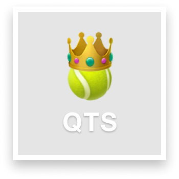

# Queens of Tennis - Women's Tennis Association (WTA) Streamlit App

### Getting Started 

1. Install Streamlit: `pip install streamlit`
2. Clone repo: `git clone https://github.com/sports-analysis-pearlhacks2021/wta-streamlit.git`
3. `cd wta-streamlit`
4. Run: `streamlit run tennis.py`

### Inspiration
In honor of Pearl Hacks' mission of celebrating and uplifting women, this project aims to better serve and empower women, specifically those in the sports industry.

Sports is an industry that is still largely male-dominated. Information that’s available for Women’s Sports is currently still very limited and is often only available in a format that is not user-friendly. This discourages prospective fans from learning more about the game (Gibbs, L. (2020, May 27). Sexism in statistics is hurting women's sports. Retrieved from https://www.powerplays.news/p/sexism-in-statistics-is-hurting-womens).

### What it does
Collects available data and displays them in a visual manner to make it less daunting to consume. Currently, it also allows us to pick 2 players and check to see who has a higher probability of learning. (This version is a relatively simple version of it, refer to “What’s next for Queens of Tennis” section to see how we’re interested in expanding on this.)

### How we built it
Python, Pandas, Streamlit, Figma, and a lot of nervous laughters ahahah .__.

### Challenges we ran into
Streamlit is a platform new to everyone in the team so we ran into a lot of technical difficulties. The data that we had to work with is also very limited, so despite having an interest in creating this sort of data-visualization for other potential women sports, the only comprehensive datasets we found were limited to more mainstream sports such as tennis and basketball.

Within those limited data, it was also difficult to find good relevant ones, and there was still a lot of cleaning up to do.

### Accomplishments that we're proud of
Despite Streamlit being something that’s foreign to all the members, the project managed to come well along the way. The team members also all met organically and have not worked together before, on top of working in different time zones remotely. We are pleasantly surprised to have been able to carry the project this far along.

### What we learned
Each member professed to have learned a whole lot within this short period of time of participating in the hackathon. In the technical aspect, the steepest learning curve for most of the members were learning Streamlit (although for our non-coding member [me], that wasn’t even on the horizon as learning to install Python to no success was as steep as it got ahaha .__. trust me we REALLY tried).

For some of our other members, learning about complex dataset, dealing with a large amount of data and how to analyze them, making linear and logistic digression, etc. were all great learning experiences. Even the little things such as learning about using Devpost, Github, etc. all counts towards our learning.

In the non-technical aspect, the entire process of the hackathon has been a very valuable experience for all of us. From the new snippets of knowledge we pick up through attending workshops, to learning how to meet and connect with new people, and working in teams with people we’ve never met before- from very different cultural and educational backgrounds- and also time difference. The team agrees that all these experiences have all massively contributed to our growth.

### What's next for Queens of Tennis
Since Streamlit was a new platform for all of us, we weren’t fully aware of what it is capable of, as well as its limitations when it comes to the amount of controls we have for the front end. Keeping in mind the goal of making data accessible, digestible, and engaging for potential sports audiences, this project could benefit from further development of the UI in the future (e.g: see Figure x).

There were also ideas that came up as we went along working on this hackathon. Some of them included our interest in implementing machine learning that would train the model in such a way that it is able to perform predictions:

This would allow for a selection of multiple players, which then generates predictions on who is more likely to win a game based on their statistics. This part aims to encourage players to engage with the information and build excitement, awareness, and presence around the Women's Tennis sports.
